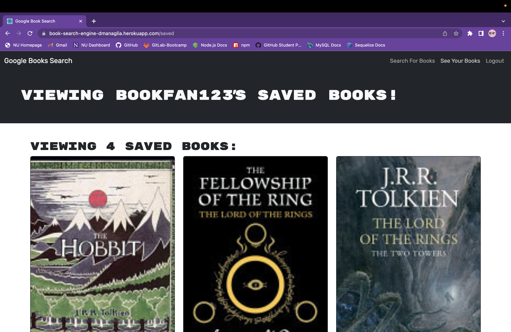

# Book-Search-Engine
  

  ## Description
  
  This project is a fully functioning book search that allows users to create an account and save their favorite books! The web application utilizes a third party API to recieve book data and saves the book data to a database whenever a user saves a book.

  This project is a react web application which also utilizes mongodb for datastorage. Sessions require token authentication and store session data in local storage for easy access. All data is then stored to and retrieved from the database for persistent data reguardless of the device users log in from.
  
  ## Table of Contents

  * [Installation](#installation)

  * [Usage](#usage)

  * [License](#license)

  * [Test](#tests)

  * [Credits](#credits)

  * [Questions](#questions)
  
  ## Installation

  No installation necessary, [Click Here To Navigate to Live Link](https://book-search-engine-dmanaglia.herokuapp.com/)
  
  ## Usage
  
  When the webpage first loads users will be presented with the search page.

  

  Users do not need to login to search up books. They can search any book in mind and they can navigate to more information on the book by clicking on the title. They cannot save the book however. To do this they must either login or signup.
  
  
  
  
  
  
  
  Once users are logged in they will be able to search all books and they have the ability to navigate to their profile page by clicking 'See Your Books' in the nav bar.

  

  Signed in users are able to save any book they are interested to their profile by clicking the button beneith every book once they have searched a title on the search page.

  

  In the saved books page users will see all the books they have saved on the search page.

  

  Users can at any time remove any book from their saved books by clicking on the 'Delete this book!' button beneath each book.

    

  ## License

  This project is licensed under the MIT license.
  
  ## Tests

  Login with test user to test functionality, or create your own personal account!

  ```
  Email: testUser@gmail.com
  Password: testPassword
  ```

  ## Credits

  - [Node](https://nodejs.org/api/documentation.html) for 3rd party packages listed in all package.json

  - [React](https://react.dev/) for front end display

  - [React-bootstrap](https://react-bootstrap.github.io/components/alerts) for prebuilt react components

  - [MongoDB](https://www.mongodb.com/) for data storage

  - [Mongoose](https://www.npmjs.com/package/mongoose) for cleaner mongo syntax and functionality

  - [GraphQL](https://graphql.org/) for mutating database requests and responses

  - [Apollo Server](https://www.apollographql.com/docs/apollo-server/) to host graphQL

  - [Express](https://www.npmjs.com/package/express) for backend server functionality

  - [JSON Web Token](https://www.npmjs.com/package/jsonwebtoken) to generate uniques session token

  - [Bcrypt](https://www.npmjs.com/package/bcrypt) to hash user passwords

  - [Google APIs](https://console.cloud.google.com/apis/library?pli=1) to retrieve 3rd party book data

  - [Starter code](https://github.com/coding-boot-camp/solid-broccoli) given by NU instruction team which had REST API functionality which I converted into MERN state that now utilizes the Apollo Server and GraphQL for the same functionality and overall cleaner syntax.

  ## Questions

  If you have any questions about the repo, open an issue or contact me directly at ddsmm.managlia@gmail.com. You can find more of my work at [dmanaglia](https://www.github.com/dmanaglia).
  